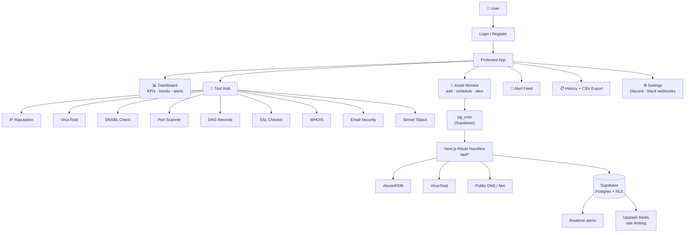

  
  <h1>ThreatSnipe</h1>
  
Monitor your assets. Get alerted when something changes.

  

    
    
    
    
    
    
  

  

---

Add an IP, domain, or subnet and ThreatSnipe monitors it. It checks reputation feeds, blacklists, and DNS records on a schedule. When something changes, alerts fire to Discord or Slack. Every investigation tool you need is already built in.

---

<!-- Replace with a screen recording showing asset monitoring and alert flow -->

---

## Screenshots

<!-- Replace with a screen recording of the lookup tools in action -->

---

## Security concepts

| Concept | How it applies |
|---|---|
| **Threat Intelligence** | Classifies IPs and domains against known IOCs using AbuseIPDB and VirusTotal |
| **OSINT / Passive Recon** | WHOIS and DNS lookups pull public data without actively probing the target |
| **DNSBL** | Checks 20+ DNS blackhole lists used by mail gateways and firewalls worldwide |
| **Email Security** | Validates SPF, DKIM, and DMARC to surface phishing-prone domain configurations |
| **Network Enumeration** | Port scanning with flagging for high-risk exposed services like RDP, SMB, and Telnet |
| **TLS / PKI** | Parses full X.509 cert chains to detect expiry and potential MitM risk |

---

## Tools

| | Tool | What it checks |
|---|---|---|
| 🛡️ | **IP Reputation** | AbuseIPDB score, ISP, geolocation, report history |
| 🌐 | **VirusTotal** | Domain/IP verdict across 70+ AV engines |
| 📋 | **Blacklist Check** | 20+ DNSBL providers simultaneously |
| 🔬 | **CIDR Scan** | Entire subnets /8–/32 for flagged hosts |
| 🔌 | **Port Scanner** | Open TCP ports and exposed services |
| 🌍 | **DNS Records** | A, AAAA, MX, TXT, CNAME, NS |
| 📄 | **WHOIS** | Registrar, creation/expiry, ownership |
| 🔒 | **SSL Checker** | X.509 chain, validity, expiry |
| 📧 | **Email Security** | SPF, DKIM, DMARC |
| 🖥️ | **Server Status** | HTTP status, latency, redirect chain |

---

## Stack

| Category | Technology |
|---|---|
| Framework | Next.js 16, App Router, Server Components |
| Database | Supabase Postgres with Row-Level Security |
| Auth | Supabase Auth, email, GitHub OAuth, Google OAuth |
| Background Jobs | Supabase pg_cron with pg_net |
| Rate Limiting | Upstash Redis |
| UI | Tailwind CSS 4, shadcn/ui, Radix UI |
| Charts | Recharts, Framer Motion |
| Cert Parsing | node-forge |

API keys are never exposed to the browser. Every external call to AbuseIPDB and VirusTotal goes through Next.js route handlers server-side.

---

## Architecture

---

## Things I learned

- SPF `~all` (softfail) gives almost no spoofing protection. Most mail servers treat it as a pass, so ThreatSnipe flags it as a misconfiguration instead of clean
- DNSBL lookups work through reverse DNS (RFC 5782), not a REST API. The format made more sense once I read how blackhole zones actually work
- RLS policies on joined tables apply independently. A join between two RLS-protected tables can silently return zero rows with no error, which took a while to debug
- User-supplied webhook URLs are an SSRF vector. All URLs are validated to HTTPS endpoints on `discord.com` or `hooks.slack.com` before any request is made

---

> Setup, SQL migrations, env vars, and pg_cron config are in [SETUP.md](SETUP.md)

  Built by <a href="https://github.com/Jayden-j">Jayden Johnson</a> · Seeking cybersecurity internship opportunities

