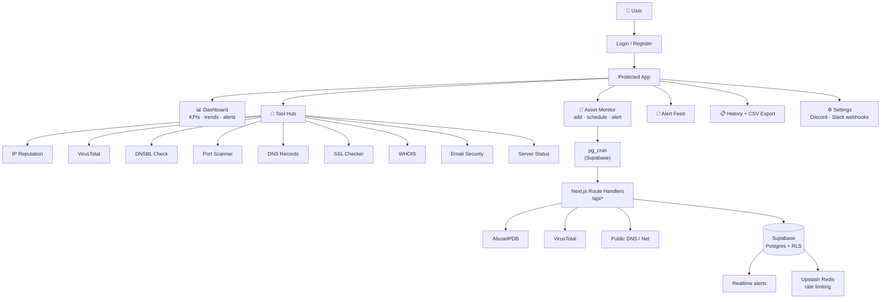

  
  <h1>ThreatSnipe</h1>
  
Monitor your assets. Get alerted when something changes.

  

    
    
    
    
    
    
  

  

---

Add an IP, domain, or subnet and ThreatSnipe monitors it — checking reputation feeds, blacklists, and DNS records on a schedule. Alerts fire to Discord or Slack when something changes. All the investigation tools are built in.

---

---

## Tools

| | Tool | What it checks |
|---|---|---|
| 🛡️ | **IP Reputation** | AbuseIPDB score, ISP, geolocation, report history |
| 🌐 | **VirusTotal** | Domain/IP verdict across 70+ AV engines |
| 📋 | **Blacklist Check** | 20+ DNSBL providers simultaneously |
| 🔬 | **CIDR Scan** | Entire subnets /8–/32 for flagged hosts |
| 🔌 | **Port Scanner** | Open TCP ports and exposed services |
| 🌍 | **DNS Records** | A, AAAA, MX, TXT, CNAME, NS |
| 📄 | **WHOIS** | Registrar, creation/expiry, ownership |
| 🔒 | **SSL Checker** | X.509 chain, validity, expiry |
| 📧 | **Email Security** | SPF, DKIM, DMARC |
| 🖥️ | **Server Status** | HTTP status, latency, redirect chain |

---

## Stack

- **Next.js 16** — Server Components for data fetching, API route handlers proxy all external calls so keys never hit the browser
- **Supabase** — Postgres with Row-Level Security, auth (email + GitHub/Google OAuth), Realtime for live alerts
- **Upstash Redis** — per-user rate limiting across all API routes
- **Recharts + Framer Motion** — trend charts and page transitions
- **node-forge** — X.509 cert parsing server-side
- **Tailwind CSS 4 + shadcn/ui**

---

## Architecture

---

## Things I learned

- SPF `~all` (softfail) gives almost no spoofing protection — most mail servers treat it as a pass. ThreatSnipe flags it as a misconfiguration
- DNSBL lookups work through reverse DNS (RFC 5782), not a REST API — the format clicked once I read how blackhole zones actually work
- RLS policies on joined tables apply independently — a join between two RLS-protected tables can silently return zero rows, which took a while to debug
- User-supplied webhook URLs are an SSRF vector — URLs are validated to HTTPS endpoints on `discord.com` or `hooks.slack.com` only

---

> Setup, environment variables, SQL migrations, and pg_cron config → [SETUP.md](SETUP.md)

  Built by <a href="https://github.com/Jayden-j">Jayden Johnson</a> · Seeking cybersecurity internship opportunities

