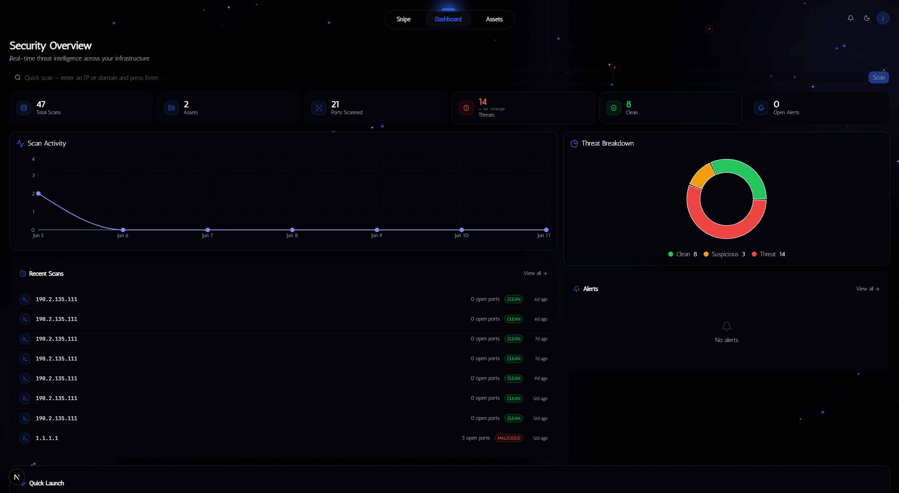
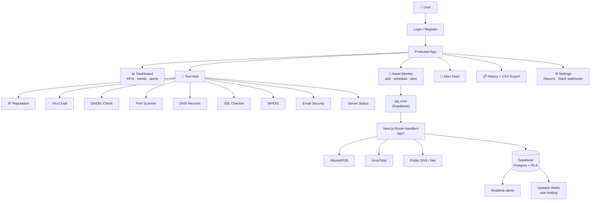

  
  <h1>ThreatSnipe</h1>
  
Monitor your assets. Get alerted when something changes.

  

    
    
    
    
  

  

    
    
    
  

  

---

Add an IP, domain, or subnet and ThreatSnipe keeps an eye on it. It checks reputation feeds, blacklists, and DNS records on a schedule — if anything changes, you get an alert in Discord or Slack. All the investigation tools you'd need are already built in.

---

## Screenshots

---

## How it works

**Add your assets**
Register any IP address, domain, or CIDR range. You pick which checks run and how often, and set your own alert thresholds per asset.

**It monitors them on a schedule**
Checks run automatically against AbuseIPDB, VirusTotal, and 20+ DNSBL providers. Every result is saved so you can see how an asset's reputation changes over time, not just where it stands right now.

**You get alerted**
When something crosses a threshold — a new blacklist hit, an abuse score spike, a domain flagged across 70+ AV engines — an alert fires and gets pushed to Discord or Slack.

**Dig in with the built-in tools**
WHOIS, DNS records, SSL cert analysis, port scanning — everything you'd want for a quick investigation without switching platforms.

---

## What this covers

The security concepts I built this around — things that came up constantly in Security+ material and TryHackMe:

**Threat Intelligence (CTI)**
ThreatSnipe pulls from AbuseIPDB and VirusTotal to classify IPs and domains against known IOCs. AbuseIPDB uses crowdsourced abuse reports; VirusTotal aggregates verdicts from 70+ antivirus engines. Threat intel is how security teams answer "is this thing actually malicious?" without just guessing. The score isn't binary either — AbuseIPDB's confidence score accounts for report recency and reporter reputation, so an IP with a score of 8 is very different from one sitting at 85.

**Email Security — SPF, DKIM, DMARC**
Phishing is still the number one initial access vector, and these three DNS records are the main technical defense against it. SPF defines which servers are allowed to send mail for a domain. DKIM adds a signature so receivers can verify the message wasn't tampered with. DMARC tells mail servers what to do when either check fails. One thing I didn't expect: SPF with `~all` (softfail) gives almost no real protection because most mail servers just let it through anyway. ThreatSnipe flags that as a misconfiguration, not a pass.

**OSINT / Passive Recon**
WHOIS and DNS lookups pull public registration and infrastructure data without touching the target directly. This is passive recon — you're gathering information from public sources rather than probing the target, which is an important distinction. It's one of the first things you do in any legitimate security assessment.

**Network Enumeration**
Port scanning shows what services a host is exposing. ThreatSnipe flags high-risk ports specifically — SMB (445), RDP (3389), Telnet (23), FTP (21), and open database ports that show up constantly in initial access and lateral movement scenarios.

**DNS-Based Blackhole Lists (DNSBL)**
DNSBLs are how mail servers and firewalls filter spam, botnets, and malware C2 infrastructure in real time. They work through reverse DNS — you flip the IP octets and query a known zone, so `192.168.0.1` becomes `1.0.168.192.zen.spamhaus.org`. ThreatSnipe checks 20+ of these simultaneously.

**TLS / Certificate Monitoring**
An expired cert causes outages and, depending on how the client handles it, can open the door to MitM attacks. ThreatSnipe parses the full X.509 chain to catch certs that are about to expire before they cause problems.

---

## Tools

| | Tool | What it does |
|---|---|---|
| 🛡️ | **IP Reputation** | AbuseIPDB score, ISP, geolocation, report history |
| 🌐 | **VirusTotal** | Domain/IP verdict across 70+ engines |
| 📋 | **Blacklist Check** | 20+ DNSBL providers at once |
| 🔬 | **CIDR Scan** | Subnets /8–/32 — surfaces flagged hosts in one pass |
| 🔌 | **Port Scanner** | Open TCP ports and running services |
| 🌍 | **DNS Records** | A, AAAA, MX, TXT, CNAME, NS |
| 📄 | **WHOIS** | Registrar, creation/expiry, ownership records |
| 🔒 | **SSL Checker** | Cert validity, chain, issuer, expiry |
| 📧 | **Email Security** | SPF, DKIM, DMARC |
| 🖥️ | **Server Status** | HTTP status, response time, redirect chain |

---

## How the app itself is secured

A few things I was deliberate about when building this:

**API keys stay server-side.** Every call to AbuseIPDB and VirusTotal goes through a Next.js route handler. The keys never hit the browser, so there's no way to grab them from network tabs. This is directly from OWASP API Security Top 10 — API8 (Security Misconfiguration).

**RLS at the database layer.** Supabase RLS policies enforce `user_id = auth.uid()` in Postgres directly, not in the app code. Even if someone bypassed the application layer, they still can't query another user's data — the restriction lives in the database.

**Rate limiting.** Per-user limits via Upstash Redis — 20 req/min for standard tools, 5 req/min for heavier ones like port scanning. Keeps things from being abused and protects the third-party API quotas.

**Cron endpoint auth.** The `/api/cron/monitor` endpoint requires a Bearer token matched against a secret generated with `openssl rand -hex 32`. No token, no access.

**Webhook SSRF.** When users paste in a Discord or Slack webhook URL, the server makes an outbound HTTP call to it — which is SSRF if you accept any URL. URLs are validated to only allow HTTPS from `discord.com` or `hooks.slack.com`.

**CSV injection.** Exported data is sanitized before download. Cells starting with `=`, `+`, `-`, or `@` get escaped so spreadsheet software doesn't execute them as formulas.

---

## Stack

- **Next.js 16 App Router** — Server Components handle data fetching, so the dashboard loads with real data and no loading spinners.
- **Supabase** — auth (email + GitHub/Google OAuth), Postgres with RLS, and Realtime for live alert updates.
- **Upstash Redis** — serverless Redis for per-user rate limiting.
- **Tailwind CSS 4 + shadcn/ui** — dark design system on Radix primitives.
- **Recharts + Framer Motion** — trend charts, threat breakdown, transitions.
- **node-forge** — X.509 cert parsing on the server.
- **GSAP + Three.js** — landing page.

---

## How it's structured

---

## What I actually learned building this

The biggest surprise was how much nuance there is in things that look simple.

AbuseIPDB's confidence score is weighted by report recency, volume, and how reliable the reporter is. It's not a vote count — an IP with 2 recent reports from trusted reporters might score higher than one with 50 old reports from throwaway accounts. Getting the thresholds right meant actually reading the documentation on how the score decays.

The SPF softfail thing caught me off guard. `~all` looks like it should do something but most receiving mail servers treat it the same as a pass. The difference between `~all` and `-all` is two characters in a DNS record, but it's the difference between actually rejecting spoofed mail and doing nothing about it.

DNSBL lookups aren't just an API call — they work through reverse DNS. You flip the octets, append the zone, and query it as a DNS record. Understanding why the format works that way (RFC 5782) made the implementation make a lot more sense instead of just following examples.

The SSRF thing I almost missed entirely. If your server makes HTTP requests to URLs that users provide, that's SSRF by definition. It's textbook OWASP and I caught it while building the webhook feature — not after.

RLS across joins took the longest to debug. When two tables both have `user_id = auth.uid()` policies and you join them, Postgres applies both policies independently. You can get zero rows back when rows definitely exist and get no error — just silence. Understanding that changed how I wrote several of the asset and alert queries.

---

> Local setup, environment variables, SQL migrations, and pg_cron config → [SETUP.md](SETUP.md)

---

  
    Built by <a href="https://github.com/Jayden-j">Jayden Johnson</a> · Seeking cybersecurity internship opportunities
  

